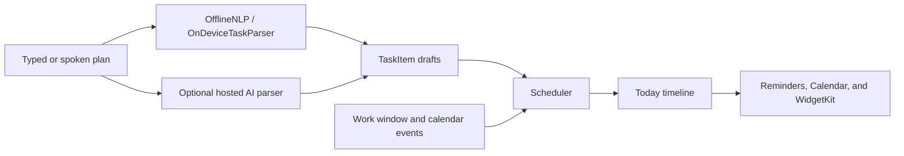
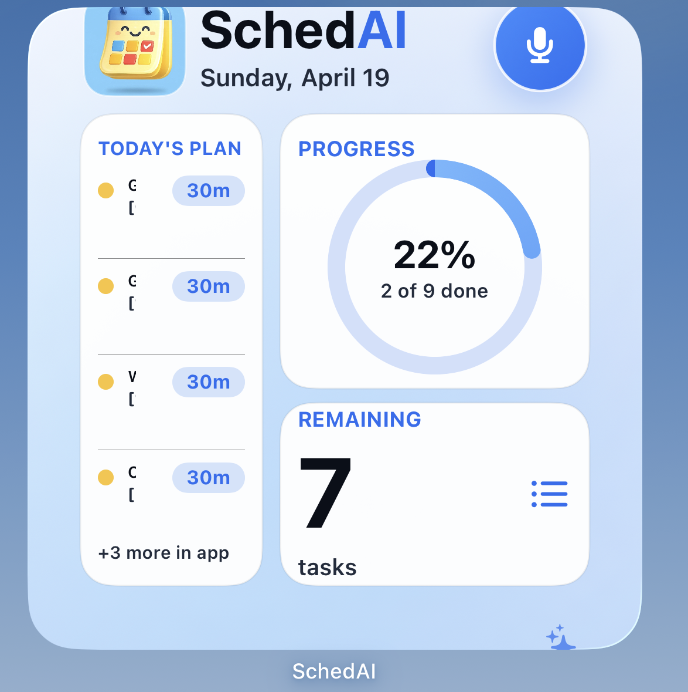
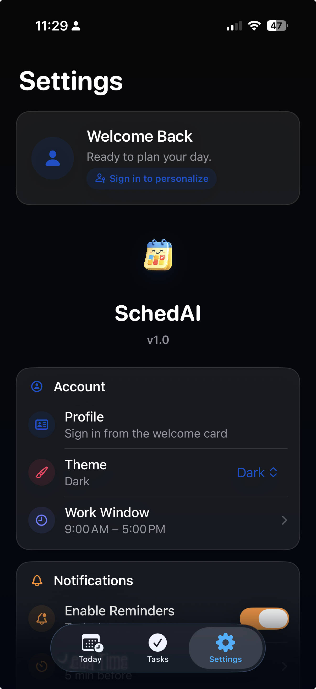

# SchedAI

SchedAI is a native iPhone planner that turns rough, natural-language tasks into a realistic daily schedule. It combines fast capture, deterministic offline parsing, calendar awareness, reminders, and a home-screen widget in a focused SwiftUI experience.

[View SchedAI on the App Store](https://apps.apple.com/us/app/schedai/id6777319679) · [Visit the product site](https://schedai-snowy.vercel.app)

## Product highlights

- Capture tasks by typing or speaking phrases such as "study for two hours tomorrow."
- Extract dates, times, durations, and task titles with the on-device parser.
- Build a schedule around work hours, fixed tasks, priorities, and busy calendar periods.
- Review the day in a native timeline and edit tasks before committing changes.
- Schedule local reminders and optionally add planned work to Apple Calendar.
- Keep the next tasks visible through WidgetKit.
- Use the core planner without a network connection or hosted AI credentials.

## How it works

`AppState` coordinates persistence and planning. `OfflineNLP` and `OnDeviceTaskParser` provide the local parsing path, while `AIService` can request richer parsing from the optional Vercel endpoint. `Scheduler` places tasks into available time, and the calendar, notification, and widget layers expose the resulting plan across iOS.

## Screenshots

| Today | Widget | Settings |
| --- | --- | --- |
|  |  |  |

## Technology

- SwiftUI and Swift Concurrency
- WidgetKit and App Intents
- EventKit and UserNotifications
- Speech framework integration
- Local persistence and shared app-group data
- Node.js and Vercel for the optional hosted parser

## Run locally

Requirements: Xcode with an iOS 17 or newer simulator, or an iPhone running iOS 17 or newer.

1. Clone the repository.
2. Open `SchedAI.xcodeproj`.
3. Select the `SchedAI` scheme and a development team if device signing is required.
4. Choose a simulator or connected iPhone.
5. Build and run.

No hosted-AI configuration is required for the offline planning flow. Calendar, notifications, speech recognition, and widgets require their corresponding system permissions.

## Verification

- Unit and UI test targets are included in `SchedAITests/` and `SchedAIUITests/`.
- A deterministic parser harness is available in `Tools/NLPTestRunner.swift`.
- Privacy manifests are included for the app and widget targets.

## Privacy

Planning works locally by default. SchedAI requests calendar, reminder, speech, or hosted-AI access only for the features the user chooses to enable. The optional hosted parser is separated from the on-device parser so the main task-planning workflow remains available offline.
